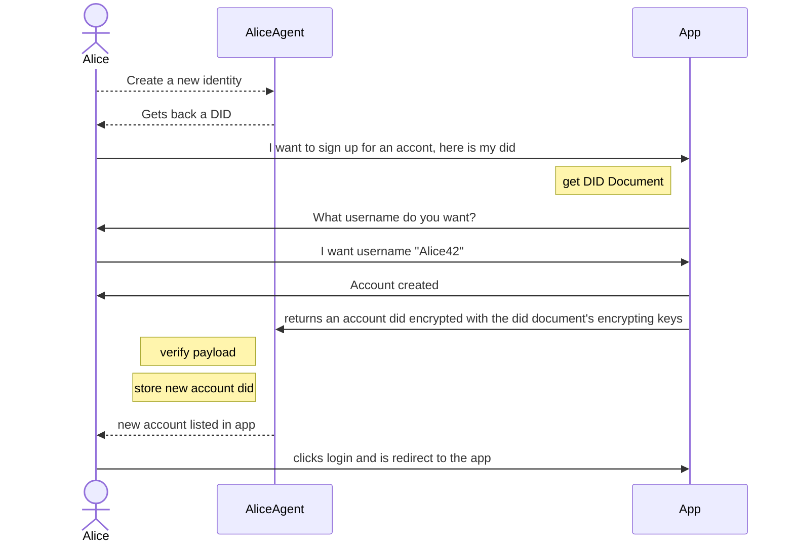

# JLINX

Self sovereign identity and data.

## Development

https://electron-react-boilerplate.js.org/docs/adding-dependencies/#module-structure

## Documents

### Types

#### Did Document

#### User Account Document

Represents your "user account" of different services. 


## Event Streams

### Types

#### User Account Events


## Links

parts: `jlinx:${type}:#{publicKey}`

```
jlinx://did:XR1uqOPeizww9JySKtvk9vVsvTpyg-v4OSmi5P6zDg0
jlinx://userAccount:QeJDBhVRzOi3_u0H62KLsUbl6R27h8HovDXHvq04118
jlinx://publicProfile:oNzcFrZUTcVCtK-Z5syjdIvvdLNn0RL6HX6CIOWJ9o0
jlinx://chatRoom:trR4cJdcqAFrcMZChlvKNKF0pV8J2GA5SL5SdMsxhWQ
jlinx://blogPost:vU3J7nkwzIBzKjy6_XY4a95njmK5sTjcT0fnAPcBpXQ
```

You can link to sepecific versions of documents

`jlinx://did:XR1uqOPeizww9JySKtvk9vVsvTpyg-v4OSmi5P6zDg0?version=12`

You can link to sepecific events in a ledger

`jlinx://userAccountEvents:XR1uqOPeizww9JySKtvk9vVsvTpyg-v4OSmi5P6zDg0?event=142`


## Login with Jlinx

Allowing anyone to create an account in your app by providing, at least, a 
[DID](link-to-dids), if not a full profile.


### User's Experience

1. user clicks "signup/login with JLINX"
2. your app generates an provides login code (as QR code and 43 char string)
3. the user hits "add account" in their jlinx app and provides the given code
4. the user is logged into your app


### Technical

1. your app generates a new UserAccountDocument
1.1 [TODO something needs to be signed with the app's public key]
2. that document's hypercore public key is given to the user
3. the user's jlinx app then… 
3.1. reads that document (also tracks it) 
3.2. extracts a url to post back to
3.3. creates its own UserAccountDocument
3.4. post back to that url with a signed jwt containing the pairwise UserAccountDocument id

the jlinx app can then write whatever keys/values it wants to its UserAccountDocument
and the app should periodically sync to it. 

the payload from the server can express the required details for signing up

the app can also direct the user to futher signup steps after the login-with-jlinx
process is complete. 


the jlinx app and the service providing app both keep records of the corisponding UserAccountDocument. Either side could alter their document to close/disable/destroy
the account.


UPDATE THIS!!!!!!VVVVVVVV



## Questions

- should we encrypt everything?
  - burn-notice records are easy to comply to. throw away your read key
  - we could send hypercode public keys along with a ready-key
